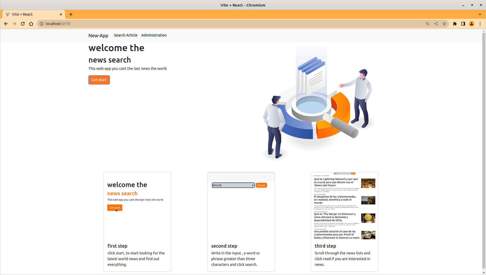
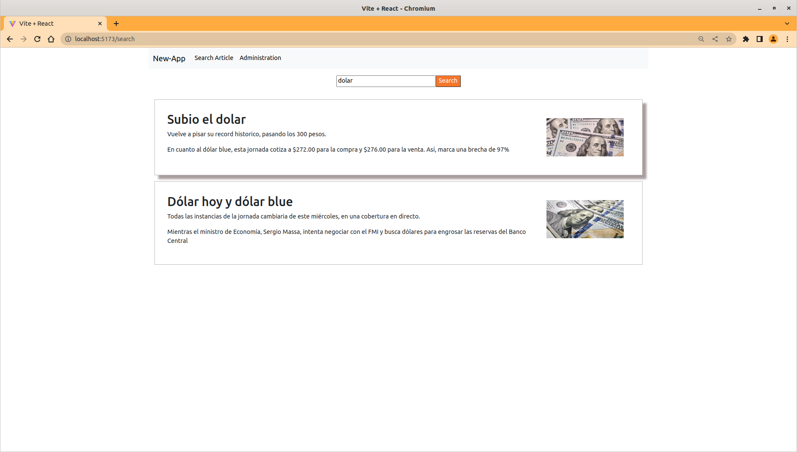
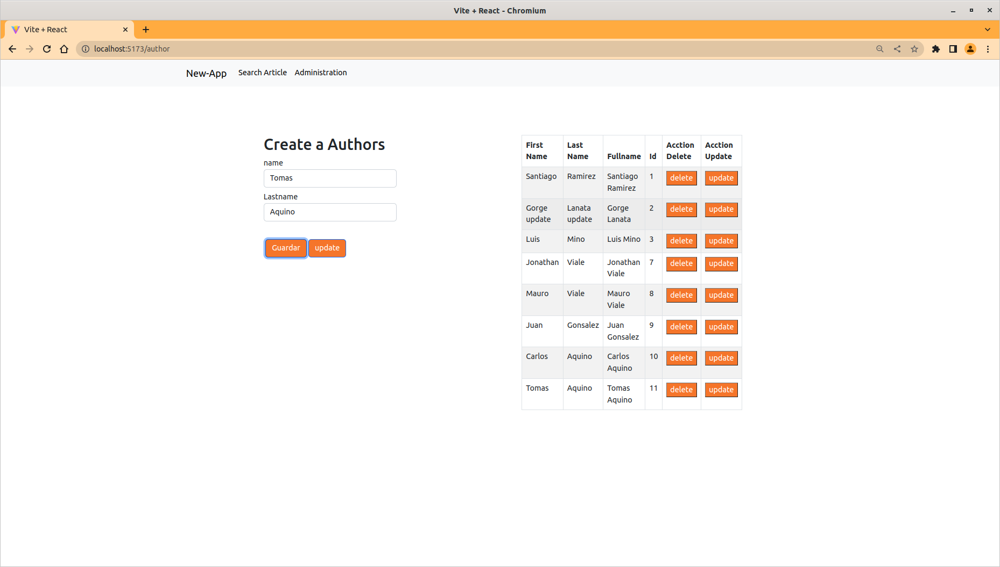

# react and spring

Integrando api hecho con spring con react, api de publicación de articulos, donde se puede hacer CRUD de los recursos article, author y source.
 [ver proyecto hecho en spring](https://github.com/santy-ramirez/news)
Las solicitudes de endpoints realizados en este proyecto:

~~~
POST http://localhost:8080/api/v1/article
GET http://localhost:8080/api/v1/article?query
POST http://localhost:8080/api/v1/article

POST http://localhost:8080/api/v1/author
GET http://localhost:8080/api/v1/author
PUT http://localhost:8080/api/v1/author/{id}
DELETE http://localhost:8080/api/v1/author/{id}
~~~

para ver la documentacion y los diferentes endpoints del proyecto hecho con spring click [Aqui](https://documenter.getpostman.com/view/21526249/VUjQkjKG)
## Screenshop 

Las tecnologias usandos en este proyecto react js,axios,bootstrap.
spring-boot, mysql

